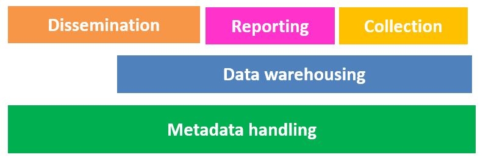
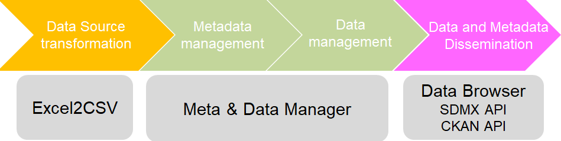

## 1. ISTAT Statkit overview 

<b>ISTAT StatKit</b> is a free and open-source toolkit allowing a statistical organization to facilitate the standardization and industrialization of the following use cases:  
  
StatKit implements the SDMX standard and it is composed by a set of pick-and-choose building blocks: 
  
---


## 2. General characteristics

•	<i>License:</i> EUPL  
•	<i>Input formats:</i> MS Excel, CSV, SDMX-ML  
•	<i>Output formats:</i> SDMX-ML, CSV, SDMX-CSV, SDMX-JSON, JSON-STAT, RDF data cube, DCAT  
•	<i>Basic software required:</i> .NET CORE 3.0, Windows Server 2012 or sup. (Windows 10 with IIS activated is supported), MS SQL Server 2012 or sup (Expression Edition is supported)  
•	<i>Open Source project</i>  

